[toc]
# kubernetes简介
> Kubernetes是容器集群管理系统，是一个开源的平台，可以实现容器集群的自动化部署、自动扩缩容、维护等功能。通过Kubernetes你可以：
1. 快速部署应用
2. 快速扩展应用
3. 无缝对接新的应用功能
4. 节省资源，优化硬件资源的使用

- 关键字: **容器编排**、**集群**、**快速部署**、**扩展应用**、**自动维护**

- **容器化技术**
     - 与操作系统解绑
         - 传统应用`开发/测试/生产环境不一致`，升级更新/回滚坑多
     - 占用资源少、部署/启动快
         - 与`虚拟化技术(KVM、Xen、VMware)`相比 
     - ...
- **容器编排**
     - 单机版容器编排: Docker-Compose
     - 多个主机节点上的容器统一调度管理
     - 集群: `超强的横向扩容能力`
     - 常见工具: /`Docker Swarm`/`kubenetes`/`Mesosphere/...`
         - https://blog.csdn.net/notsaltedfish/article/details/80959913 
         - https://www.sohu.com/a/157185937_287582

# 如何运行一个Hello world程序
## Docker for mac集成安装单机版
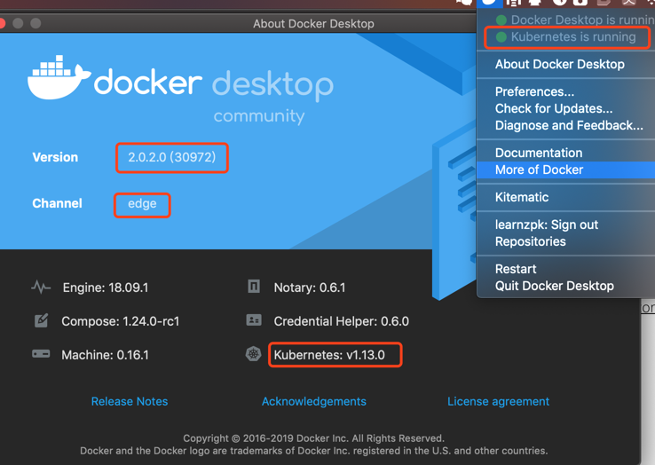

- 参考: https://blog.csdn.net/yinlongfei_love/article/details/86695917
- 运行失败若无法解决，可更新docker for mac至截图中的version/channel
- 安装成功后，执行`kubectl version`可查看服务详情

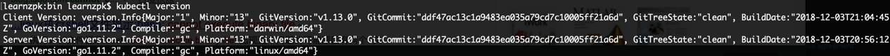

- 默认配置文件位置:  `${HOME}/.kube/config`
     - certificate-authority/certificate-authority-data: 集群的根证书
     - client-certificate/client-certificate-data: kubectl客户端证书
     - client-key/client-key-data: kubectl客户端私钥

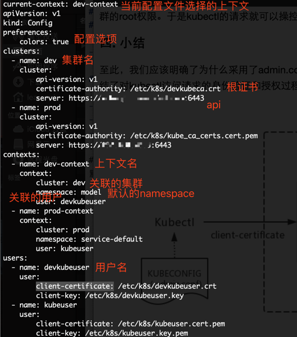

- 查看当前节点信息
     - 查看所有: `kubectl get nodes`
     - 详细信息: `kubectl describe node docker-desktop`

## 编写代码、本地运行
- 代码路径: 
- 本地运行,访问`http://localhost:60080/k8s/hello`
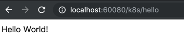


## 如何通过kubernetes部署
### 主要流程
1. 编写Dockerfile
2. 镜像build&push
3. 编写Pod的配置文件并创建
5. 编写Service(对外提供服务)并创建
```sh
#!/bin/bash

pod_template_config_path='./kube/hello/HelloPod.template.yaml'
service_config_path='./kube/hello/HelloService.yaml'

# 0. 定义镜像版本
image_version=`date +%Y%m%d_%H%M%S`
image_name=learnzpk/learn-k8s
image_url="${image_name}:${image_version}"

# 1. 构建镜像
docker build -t ${image_url} .
if [[ $? != 0 ]]; then
    echo "image '$image_url' build failed!"
    exit 1
fi

# 2. push镜像到远程，本地使用则不需要push
docker push ${image_url}
if [[ $? != 0 ]]; then
    echo "image '$image_url' push failed!"
    exit 1
fi

# 3. 应用pod
# 替换template中的镜像占位符
pod_config_path=`echo ${pod_template_config_path}|sed 's#\.template##'`
printf "image_url=${image_url}\ncat << EOF\n$(cat ${pod_template_config_path})\nEOF"|bash > ${pod_config_path}

# 生成pod
kubectl apply -f ${pod_config_path}
if [[ $? != 0 ]]; then
    echo "apply ${pod_config_path} failed!"
    exit 1
fi

## 4. 应用service
kubectl apply -f ${service_config_path}
```
### Pods
- 创建和管理Kubernetes计算的最小可部署单元
- 共享各种namespace(PID、IPC、网络、UTS等)资源的`容器集合`，有点类似于docker中同一网络下的容器

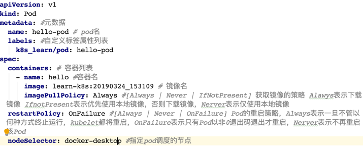

- 可以限制Pod所使用的资源
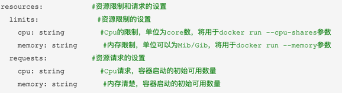 

- 将pod绑定到具体的节点上
     - `nodeName`: 直接指定nodeName，强制匹配
     - `nodeSelector`: 关联具体指定label的node
- 重启策略: Always、Never、OnFailure
- ports:
     - containerPort: 指定pod暴露的端口
     - hostPort: 映射到物理机的接口

- 查看pod相关信息 
     - 查看所有pod: `kubectl get pods` 
     - 查看具体pod: `kubectl describe pod POD_NAME`
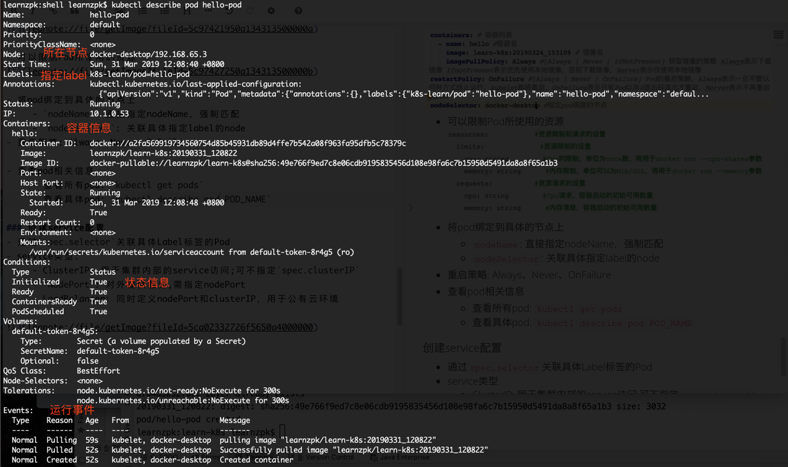

### Services
- `逻辑用于代理访问后端pod`
- 访问`http://127.0.0.1:30080/k8s/hello`

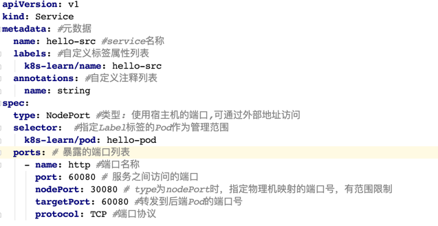
- 通过`spec.selector`关联具体Label标签的Pod，通过service访问的请求，会映射到具有任意一个匹配label的pod的targetPort上
- service类型:
     - ClusterIP: 用于集群内部的service访问;可不指定`spec.clusterIP`；`外部访问需设置代理`
     - `NodePort`: 对外提供服务,需指定nodePort
     - LoadBalancer: 同时定义nodePort和clusterIP，用于公有云环境

### Endpoints
- 一般不会把mysql这种`重IO、有状态`的应用直接放入k8s中，而是使用专用的服务器来独立部署
- k8s内部访问外部服务
     - 直接连接数据库所在物理服务器IP
     - 通过`Endpoints`直接将外部服务器映射为k8s内部的一个服务
- TEST:
     - 本地访问mongo服务: `http://127.0.0.1:60080/k8s/helloMongo`
        
     - 部署后出现: `kubectl log `查看日志
     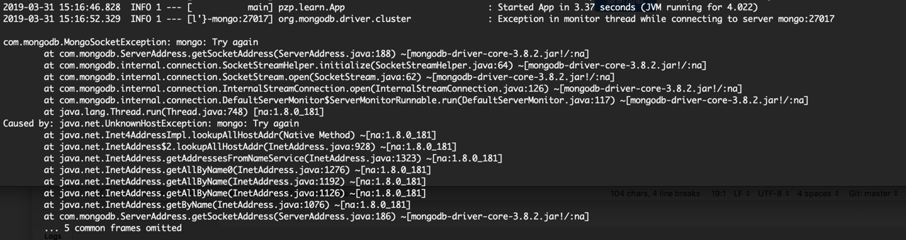
     - kubectl apply -f kube/hello/hello_endpoint/MongoEndpoint.yaml 
     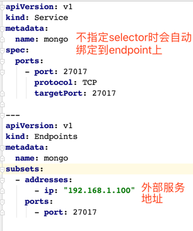

### ConfigMap
- 用于保存配置数据的键值对
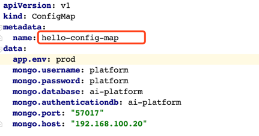
- 查看可引用配置: `kubectl get configmap`
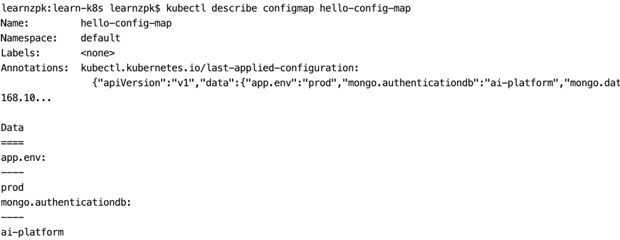
- TEST:
     - `kubectl apply -f ./kube/hello_config/HelloConfigMap.yaml`
     - 

### Secret
- Secret解决了密码、token、密钥等敏感数据的配置问题，而不需要把这些敏感数据暴露到镜像或者Pod Spec中。Secret可以以Volume或者环境变量的方式使用。

- 通过volume获取
    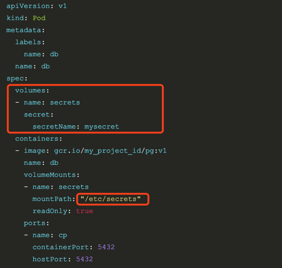
- 创建secret
     - 通过配置文件创建，value为base64编码格式
     - `kubectl create secret generic`创建

### Volumes
- 支持的挂载格式
```
emptyDir
hostPath
gcePersistentDisk
awsElasticBlockStore
nfs
iscsi
glusterfs
rbd
gitRepo
secret: 
persistentVolumeClaim
```
- **nfs**
- 使用宿主机文件: HostPath

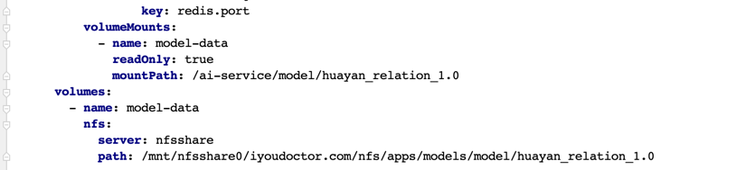

### Deployment
```
nginx-deployment2  #
kubectl rollout resume deployment/nginx-deployment2  #继续升级
/nginx-deployment2  #升级回滚
kubectl scale deployment nginx-deployment --replicas 10  

```
- 暂停升级: `kubectl rollout pause deployment/gateway`
- 继续升级: `kubectl rollout resume deployment/gateway`
- 升级回滚: `kubectl rollout undo deployment/gateway`
- 弹性伸缩Pod数量: `kubectl scale deployment gateway --replicas 10 `
- 操作版本记录(--record):` kbc rollout history deployment/gateway`
- https://www.cnblogs.com/zhenyuyaodidiao/p/6500720.html

# kubernetes基础组件
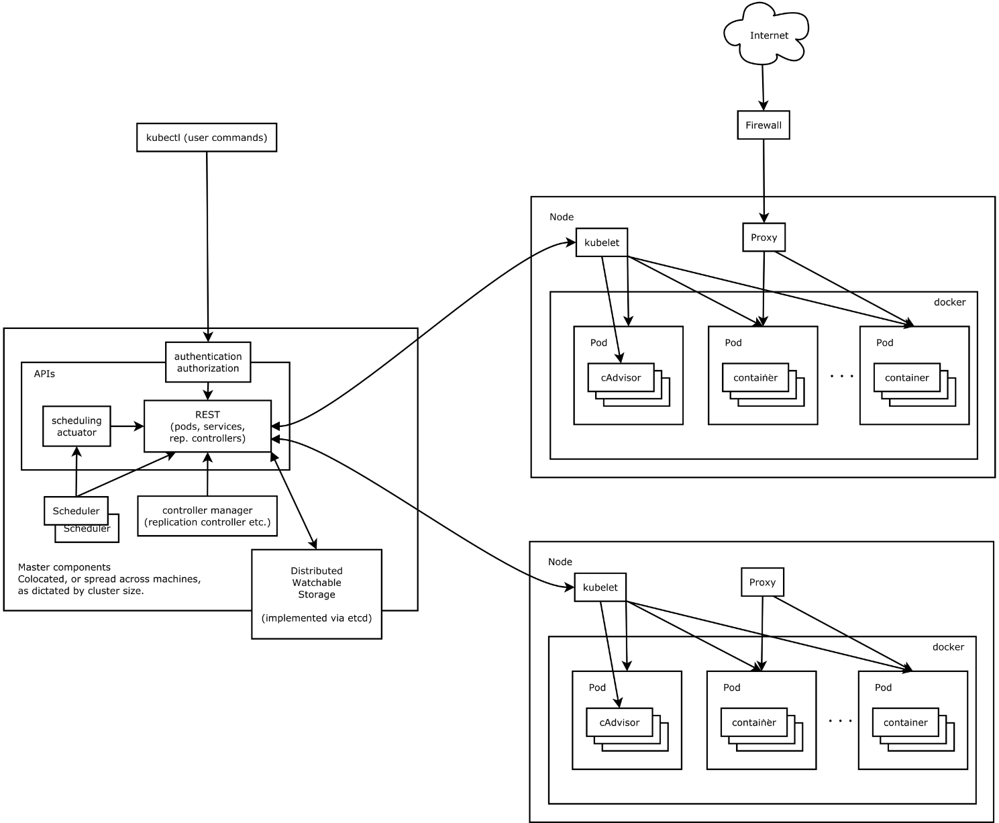 

- **kube-apiserver**: 负责暴露Kubernetes API
     - 本地访问: `无需认证和授权检查`
         - 端口: --insecure-port/8080
         - 地址: --insecure-bind-address/localhost
     - 外部访问: 使用`令牌文件`或者`客户端证书`认证，基于`策略`授权
         - 端口: --secure-port/6443
         - 地址: --bind-addresss
- **kube-controller-manager**: 管理所有的资源控制器
- **kube-scheduler**: 将pod绑定到具体的node上
- **etcd**: 存储所有需要持久化的数据
- **kubelet**: Node节点上最重要的核心组件，负责Kubernetes集群具体的计算任务
     - **pod管理**: 定期从所监听的数据源获取节点上pod 的期望状态,并调用对应的容器平台接口达到这个状态
         - 期望状态:运行什么容器、运行的副本数量、网络、存储如何配置等等 
     - 容器健康检查: 检查POD是否健康，根据`重启策略`进行处理不健康pod
     - 节点监控: 监控所在节点的资源使用情况，并定时向kube-controller-manager汇报 
- **kube-proxy**: 负责Service Endpoint到POD实例的请求转发及负载均衡的规则管理


